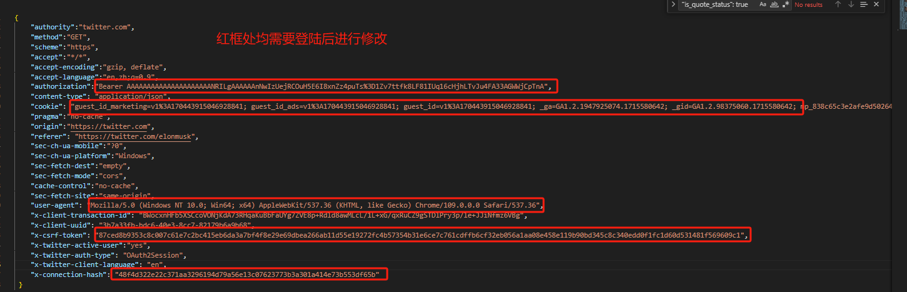
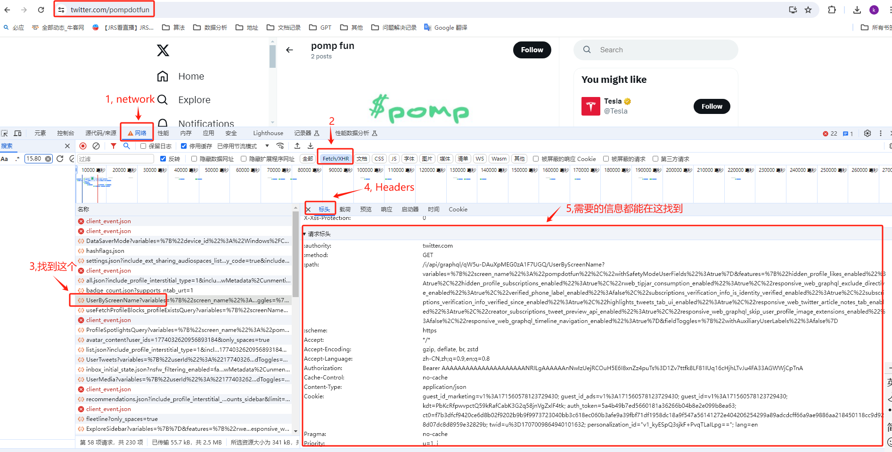
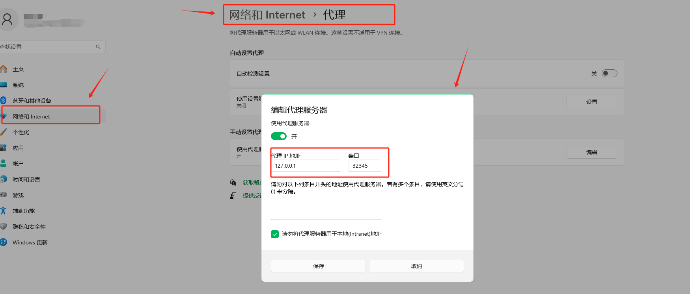

# 爬取指定用户的twitter内容
## 说明
本项目通过推特的接口进行获取数据，主要功能有；

-- 实现爬取指定用户的推特内容及链接；

-- 支持特定发布日期之间的内容获取；

## 用法
### 配置运行环境
1. 确保安装了 Python 3.6+ 环境，终端运行下述命令；
'''python
pip install -r requirements.txt
'''
### 配置参数
1. 用户只需要修改 configs_user 目录下的json文件
-- user_set.json 用于配置用户信息，包括主页url, 起始日期，终止日期；
```json
{
    "home_page": "https://twitter.com/pumpdotfun", 
    "start_date": "2024-03-01", # 可为空，为空时默认从用户注册日期开始
    "end_date": ""， # 可为空，为空时默认到当前日期
}
```

-- request_headers.json 用于配置用户的cookie等信息，可从浏览器中获取；
```json
{
    "authority":"twitter.com",
    "method":"GET",
    "scheme":"https",
    "accept":"*/*",
    "accept-encoding":"gzip, deflate",
    "accept-language":"en,zh;q=0.9",
    "authorization":"", # 需修改
    "content-type": "application/json",
    "cookie": "", # 需修改
    "pragma":"no-cache",
    "origin":"https://twitter.com",
    "referer": "https://twitter.com/elonmusk",
    "sec-ch-ua-mobile":"?0",
    "sec-ch-ua-platform":"Windows",
    "sec-fetch-dest":"empty",
    "sec-fetch-mode":"cors",
    "cache-control":"no-cache",
    "sec-fetch-site":"same-origin",
    "user-agent": "Mozilla/5.0 (Windows NT 10.0; Win64; x64) AppleWebKit/537.36 (KHTML, like Gecko) Chrome/109.0.0.0 Safari/537.36",
    "x-client-transaction-id": "BWocxnHFb5XSCcoVONjKdA73RHqaKuBbFaUYg7ZVE8p+Rdld8awMLcL/1L+xG/qxRuCZ9gSTDlPry3p/le+JJiNfmz6VBg",
    "x-client-uuid": "3b7a33fb-bdc6-40e3-8cc7-82179b6a9b68",
    "x-csrf-token": "", # 需修改
    "x-twitter-active-user":"yes",
    "x-twitter-auth-type": "OAuth2Session",
    "x-twitter-client-language": "en",
    "x-connection-hash": "" # 需修改
 }
 ```



如何获取需要的信息：

首先进入任意一个博主主页，按下F12，然后F5刷新页面，在Network中找到对应的请求，点击Headers，找到cookie和csrf-token等信息，复制到对应的json文件中



-- proxy.json 配置代理
'''json
{
    "http": "", # 示例 "http://127.0.0.1:8080", 
    "https": "", # 示例 "http://127.0.0.1:8080"
}
'''
配置时请删除 # 符号及后面内容，否则会导致程序无法运行。

如果本地有科学上网，可不配置此文件，但有注意点：

** 如果开了科学上网但无法正常运行('Unable to connect to proxy')，请关闭科学上网，并确保 main.py 第44， 46行 没有被注释掉

** 第44行的ip及端口见下图步骤获取



### 运行程序
1. 终端运行下述命令；
```python
python main.py
```

## 注意事项
1. 如果用户的推文太多，建议分时间段获取

2. 如果运行出现 429 响应代码，说明访问太过频繁，请换代理或者等一阵再运行

3. 所有获取的数据均存储于 output 文件夹下，请注意清理

